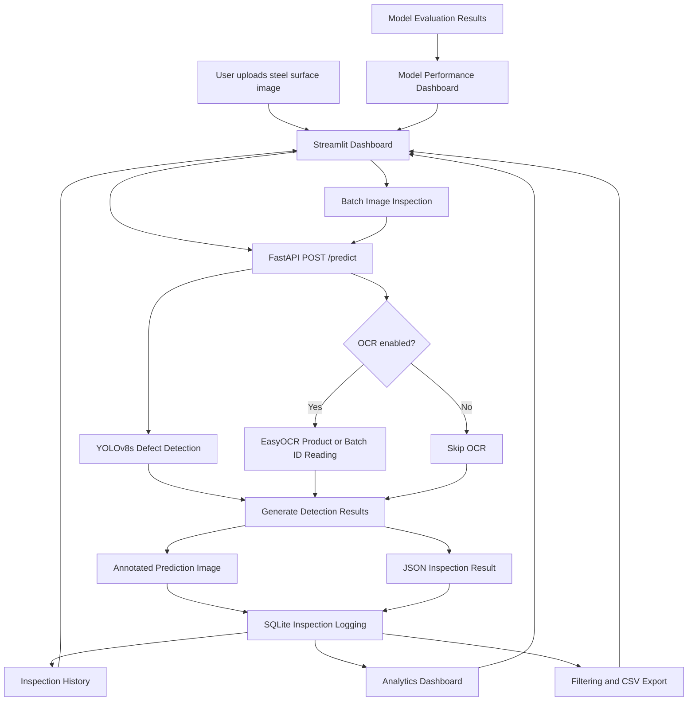
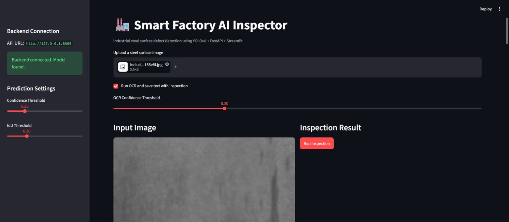
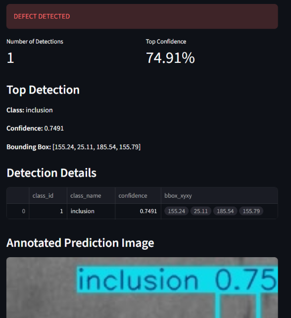
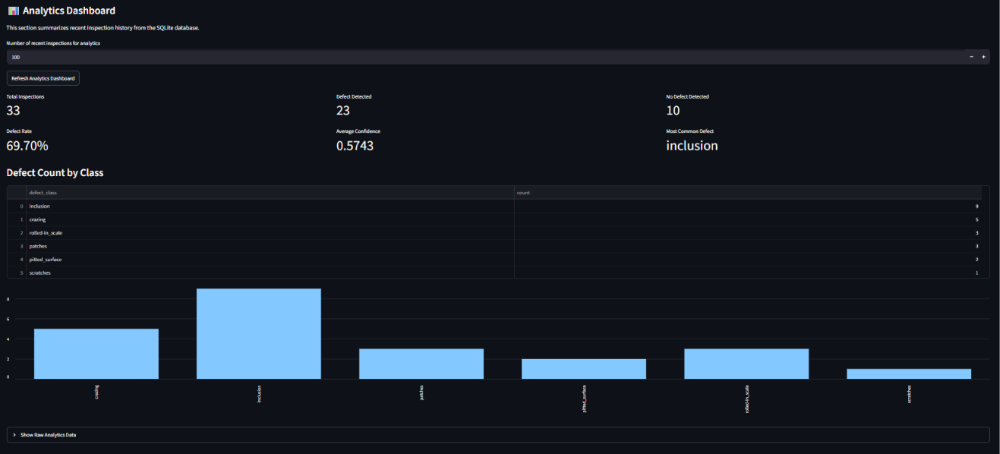
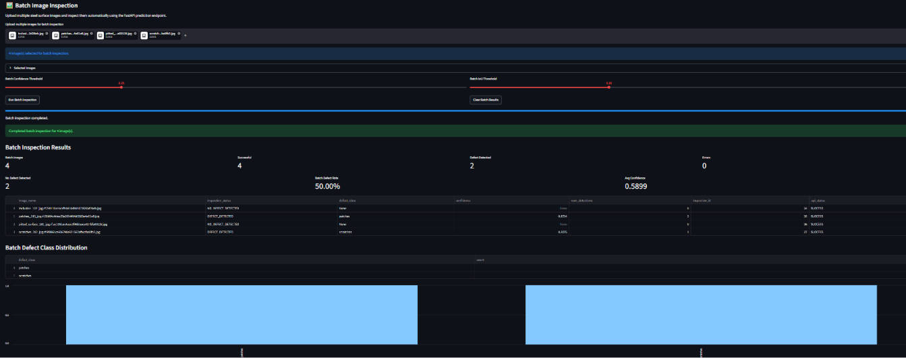
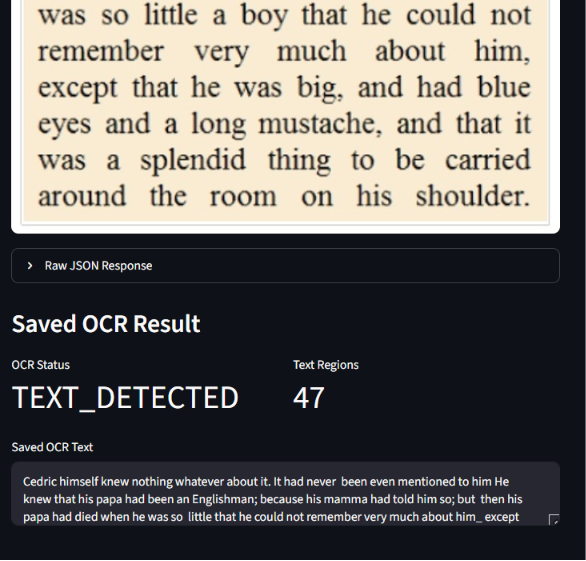
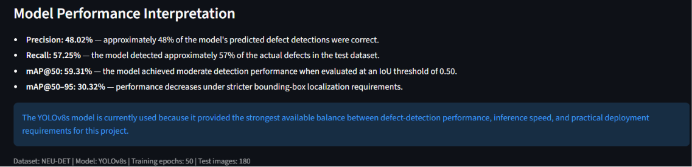
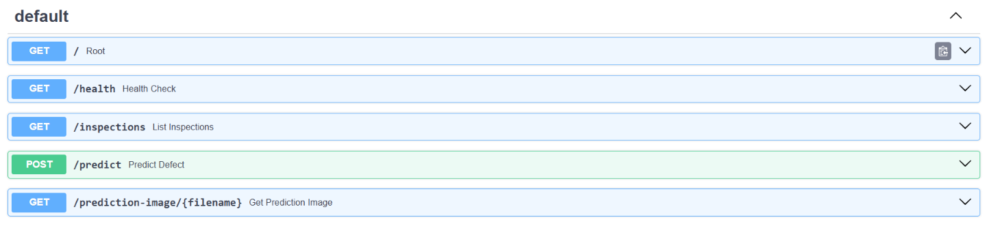

# Smart Factory AI Inspector


An end-to-end AI inspection system for manufacturing quality control using computer vision, OCR, API deployment, and dashboard analytics.


## Project Overview


Manual visual inspection in manufacturing can be slow, inconsistent, and difficult to scale. This project simulates an AI-assisted quality-control system that detects surface defects from product images, extracts product label or serial number information using OCR, stores inspection results, and visualizes inspection analytics through a dashboard.


The project is designed as a practical AI/ML engineering portfolio project. It focuses not only on model training, but also on deployment, inference API, database logging, dashboard analytics, and professional documentation.


## Project Status

**Version:** 1.0.0  
**Status:** Portfolio release completed  
**Deployment:** FastAPI and Streamlit through Docker Compose

The complete end-to-end workflow is implemented:

```text
Dataset
→ Training
→ Evaluation
→ Inference
→ FastAPI
→ EasyOCR
→ SQLite
→ Streamlit
→ Analytics
→ Batch Inspection
→ Docker Deployment


## Key Features

* Single-image steel surface defect inspection
* YOLOv8s defect detection across six NEU-DET classes
* Adjustable confidence and IoU thresholds
* Annotated prediction-image generation
* Raw JSON prediction results
* FastAPI inference backend
* Streamlit inspection dashboard
* SQLite inspection logging
* Inspection-history display
* Analytics and defect-class visualization
* Inspection filtering and CSV export
* Batch image inspection
* Optional EasyOCR product or batch ID reading
* OCR result storage in SQLite
* Model performance dashboard
* Precision, recall, mAP@50, and mAP@50–95 reporting

## Tech Stack

| Component            | Technology          |
| -------------------- | ------------------- |
| Programming Language | Python              |
| Defect Detection     | Ultralytics YOLOv8s |
| OCR                  | EasyOCR             |
| Backend API          | FastAPI             |
| Dashboard            | Streamlit           |
| Database             | SQLite              |
| Data Processing      | Pandas              |
| Model Framework      | PyTorch             |
| Version Control      | Git and GitHub      |

## Dataset and Model

The project uses the NEU-DET Steel Surface Defect Dataset in YOLO format.

The dataset contains six defect classes:

1. Crazing
2. Inclusion
3. Patches
4. Pitted surface
5. Rolled-in scale
6. Scratches

Dataset distribution:

| Split      | Images |
| ---------- | -----: |
| Training   |  1,259 |
| Validation |    360 |
| Test       |    180 |
| Total      |  1,799 |

The current deployed model is a YOLOv8s model trained for 50 epochs.

```text
models/yolov8s_neu_det_best.pt
```

Model weight files are excluded from Git because they are large runtime artifacts.

## Running the Project Locally

### 1. Activate the environment

```bat
conda activate SFAI
cd /d C:\Users\ikhwa\smart-factory-ai-inspector
```

### 2. Start the FastAPI backend

```bat
python -m uvicorn api.main:app --reload
```

FastAPI documentation:

```text
http://127.0.0.1:8000/docs
```

### 3. Start the Streamlit dashboard

Open another terminal and run:

```bat
conda activate SFAI
cd /d C:\Users\ikhwa\smart-factory-ai-inspector
python -m streamlit run dashboard/app.py
```

Streamlit dashboard:

```text
http://localhost:8501
```

Both FastAPI and Streamlit must be running for dashboard predictions to work.

## Running with Docker

The complete FastAPI and Streamlit application can also run through Docker Compose.

### Prerequisites

- Docker Desktop
- Docker Compose
- WSL 2 on Windows
- Local YOLOv8s model file

The required model must exist at:

```text
models/yolov8s_neu_det_best.pt
```

Model weights are excluded from Git and must be placed manually in the `models` directory after cloning the repository.

### Start the Application

```bat
docker compose up --build
```

Open:

```text
FastAPI documentation: http://127.0.0.1:8000/docs
FastAPI health check:  http://127.0.0.1:8000/health
Streamlit dashboard:   http://localhost:8501
```

The Streamlit container communicates internally with the FastAPI container using:

```text
http://api:8000
```

### Stop the Application

Press `Ctrl + C`, then run:

```bat
docker compose down
```

Detailed Docker instructions and troubleshooting are available in:

```text
docs/docker_deployment.md
```


## System Architecture

The Smart Factory AI Inspector combines computer vision, OCR, API development, database logging, analytics, and an interactive dashboard in one end-to-end inspection workflow.



### Main Components

| Component                   | Responsibility                                               |
| --------------------------- | ------------------------------------------------------------ |
| YOLOv8s                     | Detects and classifies steel surface defects                 |
| EasyOCR                     | Reads optional product, batch, or identification text        |
| FastAPI                     | Provides the prediction and inspection-history API           |
| Streamlit                   | Provides the interactive inspection dashboard                |
| SQLite                      | Stores YOLO and OCR inspection results                       |
| Analytics                   | Summarizes defect rates, confidence, and class distributions |
| Batch Inspection            | Processes multiple images in one workflow                    |
| Model Performance Dashboard | Displays precision, recall, and mAP results                  |

### Inspection Workflow

1. A user uploads one or multiple steel surface images.
2. Streamlit sends each image to the FastAPI prediction endpoint.
3. YOLOv8s performs steel surface defect detection.
4. EasyOCR runs when OCR is enabled.
5. The API returns the inspection status, detections, OCR result, and annotated image.
6. The complete result is saved into SQLite.
7. Streamlit displays the result, history, analytics, filters, and CSV exports.


## Project Demo

The following screenshots demonstrate the main features of the Smart Factory AI Inspector.

### Dashboard Overview

The Streamlit dashboard provides controls for uploading images, configuring confidence and IoU thresholds, enabling OCR, and running inspections.



### Single-Image Defect Inspection

The system detects steel surface defects, displays the inspection status, identifies the defect class, reports confidence scores, and generates an annotated prediction image.



### Inspection Analytics

Inspection records stored in SQLite are used to calculate total inspections, defect counts, defect rate, average confidence, and defect-class distribution.



### Batch Image Inspection

Multiple images can be inspected in one workflow. The dashboard displays batch progress, summary metrics, inspection results, and defect-class distribution.



### OCR Product and Batch ID Reading

EasyOCR can optionally extract visible text such as product IDs, batch numbers, serial numbers, or labels from uploaded images.



### Model Performance Dashboard

The dashboard presents the evaluation performance of the deployed YOLOv8s model, including precision, recall, mAP@50, and mAP@50–95.



### FastAPI Backend

FastAPI provides endpoints for health checks, YOLOv8 predictions, annotated prediction images, OCR processing, and inspection-history retrieval.




## Database Logging and Inspection History

The project includes SQLite-based inspection logging.

Every prediction request made through the FastAPI backend is automatically saved into a local SQLite database. Each inspection record stores the timestamp, uploaded image name, inspection status, detected defect class, confidence score, number of detections, and annotated output image path.

The Streamlit dashboard also includes an inspection history table, allowing recent prediction records to be viewed directly from the web interface.

Database-related files:

```text
database/schema.sql
database/db.py
docs/database_logging.md
```

### API Endpoints

| Method | Endpoint                       | Description                                    |
| ------ | ------------------------------ | ---------------------------------------------- |
| GET    | `/`                            | API root information                           |
| GET    | `/health`                      | Backend and model health check                 |
| POST   | `/predict`                     | Upload image and run YOLOv8 defect detection   |
| GET    | `/prediction-image/{filename}` | Retrieve annotated prediction image            |
| GET    | `/inspections`                 | Retrieve recent inspection history from SQLite |


### Version 6A–6B: Analytics Dashboard, Filtering, and CSV Export

The Streamlit dashboard includes an analytics section based on inspection records stored in SQLite.

Current analytics features:

* total inspection count
* defect detected count
* no defect detected count
* defect rate percentage
* average confidence
* most common defect class
* defect count by class table
* defect count by class bar chart
* filtered inspection history
* CSV export for filtered records

Documentation:

```text
docs/analytics_dashboard.md
```


### Version 7A–7D: Batch Image Inspection

The Streamlit dashboard supports batch image inspection.

Users can upload multiple steel surface images, run inspection for each image through the FastAPI `/predict` endpoint, view batch-level summary metrics, and download the batch result as a CSV file.

Current batch inspection features:

* multiple image upload
* repeated FastAPI `/predict` calls
* confidence threshold control
* IoU threshold control
* selected image counter
* selected image list
* progress bar during inspection
* clear batch results button
* batch result table
* successful inspection count
* batch defect count
* batch no-defect count
* batch error count
* batch defect rate
* average confidence
* defect class distribution table
* defect class distribution bar chart
* CSV export for batch results
* automatic SQLite logging for each successful prediction


Documentation:

```text
docs/batch_inspection.md
```

### Version 8A–8D: OCR Integration

The project includes OCR support for reading visible text such as product IDs, batch numbers, serial numbers, or labels.

OCR features:

- standalone OCR prototype in Streamlit
- optional OCR during main inspection
- OCR result returned by FastAPI `/predict`
- OCR result saved into SQLite
- OCR status shown in inspection history
- OCR text shown in inspection history
- OCR text region count shown in inspection history

OCR database fields:

- `ocr_status`
- `ocr_text`
- `ocr_num_text_regions`
- `raw_ocr_json`

Documentation:

```text
docs/ocr_integration.md
```


---

## Version 9 — Model Performance Dashboard

Version 9 adds model evaluation visibility to the Smart Factory AI Inspector.

The project now shows not only inspection results, but also the machine learning performance of the deployed YOLOv8s model.

### Version 9A — Model Performance Dashboard

The Streamlit dashboard now includes:

* Precision
* Recall
* mAP@50
* mAP@50–95
* Evaluation result table
* Performance bar chart
* Metric explanations
* Model information
* Dataset information

### Version 9B — Model Performance Documentation

Detailed model evaluation documentation is available at:

```text
docs/model_performance.md
```

The documentation explains:

* NEU-DET dataset distribution
* YOLOv8s model configuration
* Evaluation metrics
* Performance interpretation
* Reasons for selecting YOLOv8s
* Current model limitations
* Possible future improvements

### Current YOLOv8s Test Performance

| Metric    |  Score |
| --------- | -----: |
| Precision | 0.4802 |
| Recall    | 0.5725 |
| mAP@50    | 0.5931 |
| mAP@50–95 | 0.3032 |

The current production model is:

```text
models/yolov8s_neu_det_best.pt
```

The model was trained for 50 epochs using the NEU-DET steel surface defect dataset.

Version 9 demonstrates knowledge of model evaluation, performance interpretation, and deployment—not only application development.


